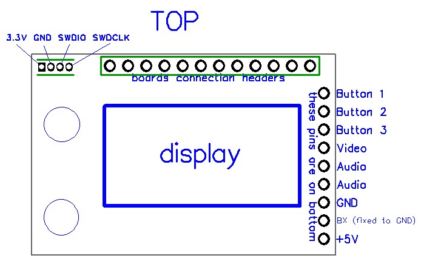
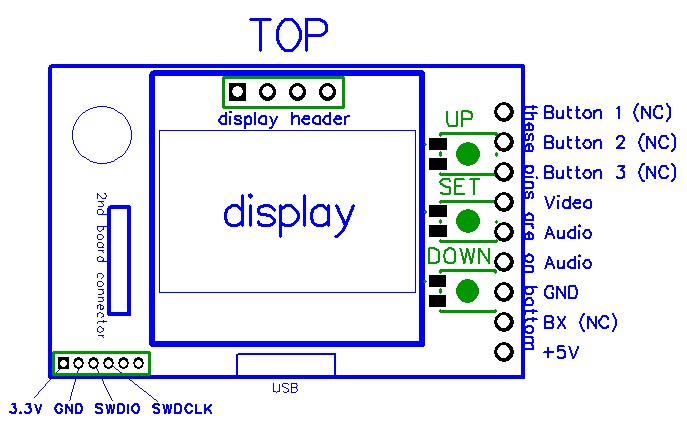

# WPro58 for Eachine PRO58 and Quanum HB5808 modules.
STM32 MCU based diversity module firmware.

This firmware uses some code from [Shea Ivey's rx5808-pro](https://github.com/sheaivey/rx5808-pro-diversity) 

If you like this work and you're buying Eachine PRO58 please use this link:
[Eachine PRO58](https://www.banggood.com/Eachine-PRO58-RX-Diversity-40CH-5_8G-OLED-SCAN-VRX-FPV-Receiver-for-FatShark-Goggles-p-1160357.html?p=CL07182964413201511Q)
(It's a reflink)

### Pinouts and flashing.

To flash your PRO58 or HB5808 module you have to use ST-link programmer.
The best way to flash your module is:
1. Connect 5V power and GND via Fatshark connector - Use 5V BEC with at least 1A of current,
2. Connect GND, SWDIO and SWDCLK to ST-Link via SWD connector (on top left corner of module - see images).
3. Use ST-LINK Utility from ST web page - http://www.st.com/en/development-tools/stsw-link004.html - look on the bottom of page for download.
4. If its brand new module you have to remove _Read Out Protection_. In ST-LINK Utility Click on _Target -> Option Bytes..._ .
Set _Read Out Protection_ to _Disabled_ and next click _Apply_ (**_WARNING_**: This will erase original firmware - there is no way back). Do not touch other things in this menu.
5. Load .bin file by clicking Open file button, and next _Target -> Program and verify..._
6. Once it finish witout error you have WPro58 installed. Disconnect all and then reconnect power ;)

Remember that module draws ~0.4A of current, power it with efficient power supply!

To edit/build code you need to download [SW4STM32](http://www.openstm32.org/HomePage) IDE (Eclipse based)

#### Eachine PRO58 pinouts

___

#### Quanum HB5808 pinouts

FatShark pins are not connected to MCU.
___

### Big thanks to
- **mihero** for contributing
- **20Sy** for HB5808 module ;)
- **conkerkh** for contributing

#### Warning!
If you use module with FatShark goggles make sure that FS pins mode setting is set to FS (not BUTTON).
This settings changes pullup settings on FS channel pins.

To use BUTTON mode simply add buttons that connect pin to ground when pressed.

___

 This work is licensed under a <a rel="license" href="http://creativecommons.org/licenses/by-nc-sa/4.0/">Creative Commons Attribution-NonCommercial-ShareAlike 4.0 International License</a>.
