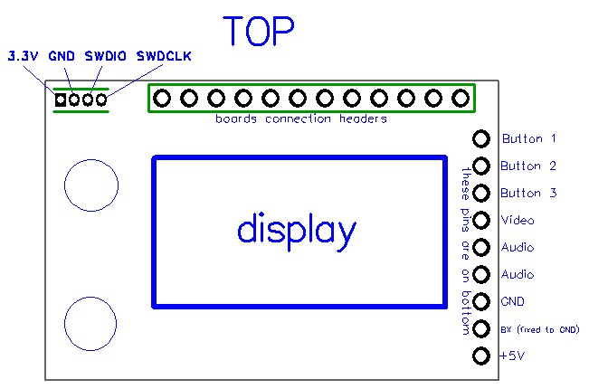

# rx5808-pro-diversity-pro58
STM32 based PRO58 module firmware based on 

### Pinouts and programming.
To program PRO58 you have to use ST-link programmer.
Connect 5V power and GND via Fatshark connector and GND, SWDIO and SWDCLK to ST-Link via SWD connector.
Remember that module draws 360 mA of current, power it with efficient power supply!

To edit/build code you need to download  IDE (Eclipse based)

 This work is licensed under a <a rel="license" href="http://creativecommons.org/licenses/by-nc-sa/4.0/">Creative Commons Attribution-NonCommercial-ShareAlike 4.0 International License</a>.
